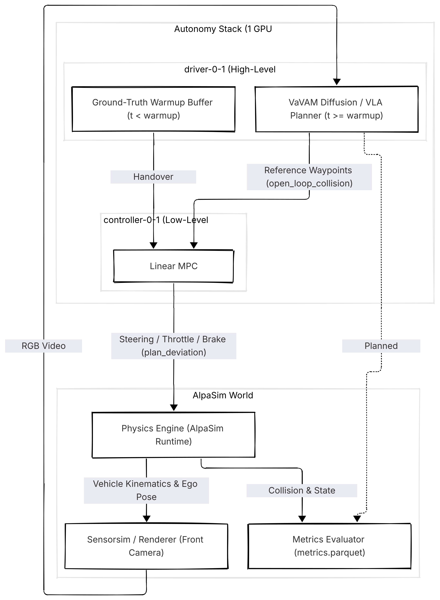

# Closed-Loop Red-Teaming & Verification for Vision-Language-Action (VLA) Policies

Automated safety verification framework for end-to-end autonomous driving policies (VaVAM) in AlpaSim. Employs agentic LLMs and Bayesian Optimization to uncover non-trivial failure boundaries across temporal context and compute latency dimensions.

## Core Contributions & Findings

* **Failure Attribution Disproof:** Analyzed 200+ safety-critical incidents. Disproved low-level Linear MPC tracking failure by correlating \(plan\_deviation\) against \(open\_loop\_collision\). Confirmed 100% of initial collisions originated from high-level VLA trajectory planning collapse.
* **Temporal Starvation Root Cause:** Identified a policy vulnerability where ground-truth warmups \(\le 2.0\text{s}\) starved the diffusion planner of temporal frame history, causing default forward cruising into obstacles.
* **Asynchronous Compute Stress-Testing:** Evaluated closed-loop robustness under artificial inference delays (\(50\text{ms}\)–\(200\text{ms}\)), exposing kinematic drift and boundary degradation under compute lag.
* **Hardware-Aware Memory Isolation:** Architected CPU-isolated FP32 inference for the LLM adversary to eliminate VRAM resource contention with AlpaSim's camera rendering pipeline on single 12GB GPU hardware.

## System Topology & Interface

The framework orchestrates closed-loop rollouts across isolated Docker containers:
1. **Perception/Sensorsim:** Generates \(120^\circ\) front-camera RGB frames.
2. **Policy (VaVAM):** Ingests frames and outputs reference waypoints \([x, y, \theta, v]^T\).
3. **Controller (Linear MPC):** Minimizes trajectory tracking error into throttle, brake, and steer commands.
4. **Adversary (Qwen2.5 / Optuna):** Ingests Parquet telemetry, computes plan deviations, and executes parameter mutations.

## Repository Structure

* `src/autolab_loop.py`: Closed-loop simulation harness and telemetry aggregation.
* `src/lora_agent.py`: CPU-offloaded LLM mutation agent.
* `src/baseline_optuna.py`: Bayesian Optimization (TPE) baseline minimizing obstacle distance.
* `src/baseline_random.py`: Uniform stochastic search baseline.
* `src/analyze_cp2.py`: Automated failure boundary extraction and visualization.
* `configs/redteam_bounds.json`: Dynamic parameter mutation boundaries.
