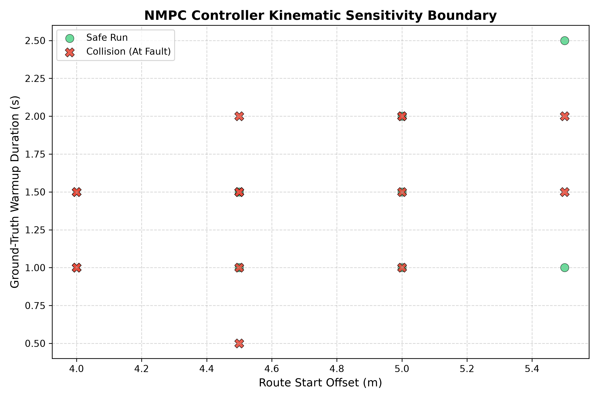

# AutoLab Harness

Autonomous closed-loop red-teaming harness for AV controllers using local LLM agents and containerized simulation telemetry.

## System Overview

AutoLab automates failure discovery for autonomous driving controllers inside NVIDIA AlpaSim. A local reasoning model (Qwen 2.5) evaluates rollout telemetry and iteratively mutates control and initialization boundaries.

## Repository Structure

- `autolab_loop.py`: Primary orchestration loop, Ollama client, and simulation execution bridge.
- `plot_boundaries.py`: Telemetry parser and sensitivity boundary scatter plotter.
- `format_sft.py`: SFT pipeline converter that formats execution traces into ChatML JSONL.

## Quick Start

1. Install required packages:
   pip install -r requirements.txt

2. Ensure local Ollama instance is active:
   ollama run qwen2.5-coder:3b

3. Execute batch harness:
   python autolab_loop.py
